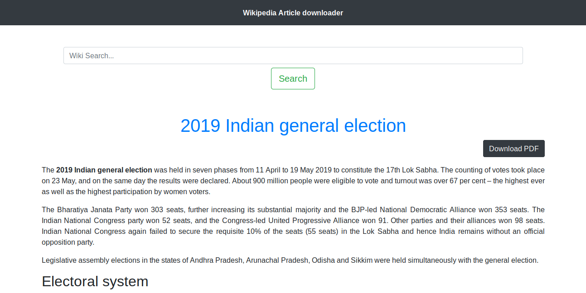
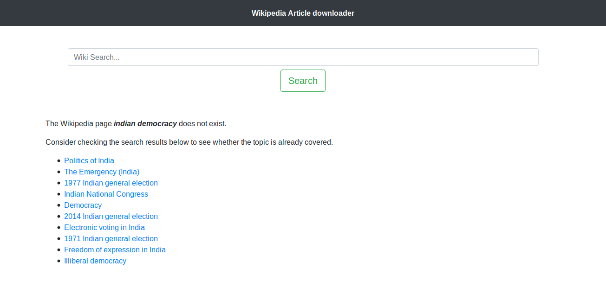
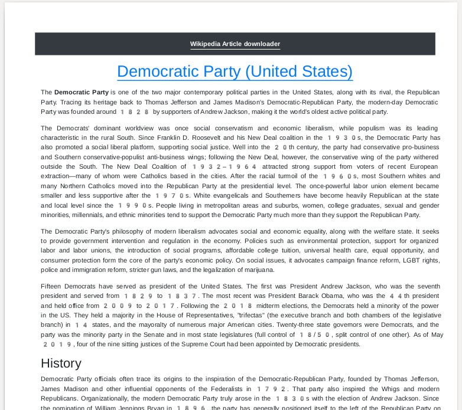

# Wikipedia Article downloader

A website to download Wikipedia articles as pdf documents.

# Features
- Search functionality to discover wikipedia articles.
- Auto suggest powered by wikipedia api.
- Similar Article Suggestion functionality in case of the queried article not available. 
- Read article and download as PDF. 

## Packages Used

1. [Django](https://www.djangoproject.com/)
2. [Wikipedia](https://wikipedia.readthedocs.io/en/latest/quickstart.html#quickstart)
3. [Wikipedia-API](https://pypi.org/project/Wikipedia-API/)
4. [WeasyPrint](https://weasyprint.readthedocs.io/en/stable/)

## Installation

Use the package manager [pip](https://pip.pypa.io/en/stable/) to install packages.

```bash
# Virtual Environment
sudo -H pip3 install -U pipenv
pipenv --python 3.6
pipenv shell

# Package Requirements
pip install -r requirements.txt
```

## Run Django Server
The Website could be run on browser at [http://127.0.0.1:8000/](http://127.0.0.1:8000/) after running following command on terminal.

```bash
python manage.py runserver
```

## Images






## Contributing
Pull requests are welcome. For major changes, please open an issue first to discuss what you would like to change.

Please make sure to update tests as appropriate.

## License
[MIT](https://choosealicense.com/licenses/mit/)